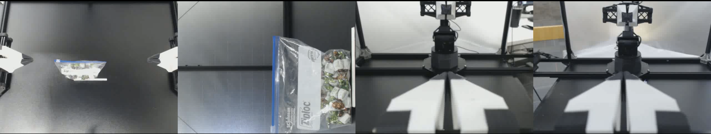

# Robot Data Segmentation Agent

## Overview

The **Robot Data Segmentation Agent** is a tool designed to semantically segment robotic action sequences in video streams and generate natural language descriptions using GPT. The application consists of a backend service for video processing and AI integration, and a frontend service for user interaction and visualization.

---

## Architecture

The system is structured with a **backend service** for processing video frames and generating descriptions, and a **frontend service** for displaying results and interacting with the user. Communication between services is managed through a Docker Compose setup, ensuring isolated and scalable deployment.

The backend service is structured to handle the following:

1. Video Upload and Download - Video files can be uploaded directly or downloaded from a URL.
2. Job Management - Each video processing request is treated as a job, identified with a unique job ID.
3. Video Analysis - The backend processes the video frames, annotates them, and interacts with GPT for semantic analysis.
4. WebSocket Communication - Real-time status updates are sent to the frontend using WebSocket.
5. Redis Integration - Job statuses and results are stored and updated in Redis for persistence and quick lookup.

## Assumptions & Limitations

1. Assume the video is in mp4 format and contains four camera views aligned horizontally
    - Top, Side, ARM1 mounted, ARM2 mounted:


### Prokect Structure

```
robot-data-segmentation-agent/
├── README.md
├── backend-app: All backend functionalities
│   ├── Dockerfile
│   ├── ai_utils.py
│   ├── app.py
│   ├── config.py
│   ├── job.py
│   ├── prompt.py
│   ├── redis_client.py
│   ├── requirements.txt
│   ├── utils.py
│   └── video_utils.py
├── frontend-app: All frontend functionalities
│   ├── Dockerfile
│   ├── README.md
│   ├── jsconfig.json
│   ├── node_modules
│   ├── package-lock.json
│   ├── package.json
│   ├── public
│   └── src
├── run.sh
├── docker-compose.yml
└── cleanup.sh
```

---

## Backend Service

The backend service is a Flask application running with **SocketIO** for real-time updates and **Gunicorn** for HTTP serving.

- **Run Command:**

  ```bash
  gunicorn -k eventlet -w 1 -b 0.0.0.0:8080 app:app
  ```

- **WebSocket Support:** Handles real-time job status updates through `job_update`, `job_done`, and `job_error` events.
- **Async Job Processing:** Video processing jobs are handled asynchronously using `start_background_task`.
- **Redis Integration:** Used for state persistence and job status tracking.

### Key Endpoints

- `/`: Check if the service alive
- `/run_job`: Accepts a video file or URL, starts processing, and returns a job ID.

### Backend Modules

- `app.py`: Main application and socket setup.
- `ai_utils.py`: GPT interaction and text generation.
- `video_utils.py`: Video frame extraction and processing.
- `prompt.py`: Templates for semantic analysis prompts.
- `job.py`: Manages job lifecycle and processing.
- `redis_client.py`: Interface for Redis communication.

---

## Frontend Service

- React-based UI for uploading videos and viewing segmentation results.
- WebSocket integration for real-time status updates.

### Key Features

- Video upload via URL or file.
- Real-time processing updates.
- Display of segmented action results.

---

## Deployment

To deploy the application, use Docker Compose:

```bash
./run.sh <OPENAI_KEY>
```

Note: make sure you have enough credit the run gpt-4o model
you can get the key from: https://platform.openai.com/api-keys

This will:

- Start the **Backend Application** using Gunicorn with Eventlet workers.
- Launch the **Redis Service** as a message broker.
- Deploy the **Frontend Application** for user interaction.

To stop all services:

```bash
docker-compose down
```

To clean up the environment, run:

```bash
./cleanup.sh
```

⚠️ Port Availability Requirement

Before running the application, ensure the following ports are available:

8080 → Backend service

3000 → Frontend service

6379 → Redis service

If any of these ports are in use, the containers will fail to start correctly.

To stop all services:

docker-compose down

## Frontend Access

Once the application is running, you can access the Frontend UI from browser at:

```bash
http://localhost:3000
```

Usage Steps:

1. Open the frontend URL in your browser: <http://localhost:3000>
2. You can upload a video file or provide a direct URL to a .mp4 video.
3. Click Next to confirm the selection and move to the analysis step.
4. Click Upload and Start Analysis to begin processing.
5. Real-time status updates will be displayed on the screen.
6. Once the analysis is complete, the segmented JSON results will be shown.


## Demo Video

1. Upload & analyze video by submitting mp4 file:
https://youtu.be/o3bq1TY5M3A

2. Use video url to analyze:
https://youtu.be/EYyX-l5RSEs

---
